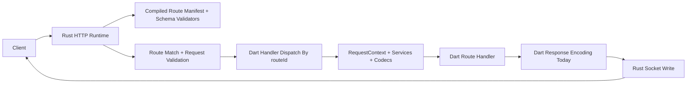

# Dart Edge Concept

This document should describe the repository as it exists today and the
direction it is intentionally moving toward. It is not a pure wish list. If the
code and this file drift apart, the file should be rewritten.

The repo is now a real Pub workspace with multiple product slices, not just a
single experimental server package. The concept needs to match that.

## Thesis

Dart Edge is a Dart-first backend platform built around:

- a Rust-backed HTTP runtime
- explicit route and schema contracts
- build-time code generation around those contracts
- native-backed service packages that integrate cleanly with the runtime

The important split is still the same:

- Dart owns application structure, route behavior, domain logic, and service
  composition.
- Rust owns transport and other native-heavy subsystems where performance,
  protocol behavior, or ecosystem leverage matter.

But the repo has moved beyond a single "Rust transport runtime" story. The
platform now has three connected axes:

1. application runtime
2. contract and codegen pipeline
3. native service packages

That is the current shape of the project.

## What The Repo Is Now

The workspace already contains:

- `dart_edge_http_server`: the app-facing umbrella package
- `dart_edge_http_server_runtime`: the shared contract surface plus the Rust-backed HTTP
  runtime
- `dart_edge_helpers`: optional helper routes, currently centered on OpenAPI
  mounting
- `dart_edge_http_server_codegen`: HTTP generator-facing annotations and normalized client
  generation
- `dart_edge_auth`: native Better Auth route mounting for Dart Edge apps
- `dart_edge_sql`: native-backed typed SQL pools and query builders
- `dart_edge_sql_codegen`: schema introspection and Dart descriptor generation
- `dart_edge_sql_migrator`: ordered SQL migrations on top of `dart_edge_sql`
- `dart_edge_audio`: native-backed audio probing and conversion utilities
- `dart_edge_sip`: standalone native SIP runtime package for
  backend-controlled VoIP and PBX-style call handling
- `benchmarks/*`: comparative benchmark targets and the benchmark runner

That means Dart Edge is no longer just "a framework idea". It is becoming a
backend platform where multiple packages share contracts, schema concepts, and a
native integration model.

The HTTP runtime is the real delivered center today. The HTTP codegen package
now exposes annotations, generated route artifacts, schema registry output,
runtime codec registry skeletons, and client-generation pieces. A full
analyzer-backed builder remains a later layer. WebSocket contract types exist,
but WebSocket transport is not yet the shipped path.

## Product Position

Dart Edge is not "edge compute" in the browser-worker or serverless sense.

It is also not just:

- a nicer wrapper around `dart:io`
- a Rust web server with a thin Dart callback bridge
- a bag of unrelated native packages that happen to live in one workspace

The intended position is:

- Dart as the application language
- Rust as the transport and native-systems layer
- explicit contracts as the boundary between authoring, runtime behavior, docs,
  validation, and generated clients

If the name stays `Dart Edge`, the docs should keep saying this clearly. The
product is about the edge of a Dart backend system, not browser-style edge
deployment.

## Why The Monorepo Matters

The workspace is deliberate. These packages are not independent experiments.

They share:

- route options
- schema references and registry concepts
- native ABIs and build-hook conventions
- generated client and codegen expectations
- app-facing ergonomics through the umbrella package

Keeping them in one Pub workspace makes it possible to evolve the runtime,
codegen, auth, SQL, audio, and benchmark story together instead of pretending
they can all be versioned in isolation from day one.

## Platform Shape

### 1. Application Runtime

This is the core HTTP application path:

- `dart_edge_http_server`
- `dart_edge_http_server_runtime`
- `dart_edge_helpers`

This axis is responsible for:

- starting the server
- registering routes
- compiling route metadata into a native manifest
- validating incoming requests
- decoding typed inputs for Dart handlers
- generating OpenAPI documents from route options and schema registries
- serving convenience helper endpoints such as OpenAPI JSON and Swagger UI

### 2. Contracts And Codegen

This is the normalization axis:

- `dart_edge_http_server_codegen`
- `RouteOptions`
- `JsonSchemaRef`
- `JsonSchemaRegistry`
- runtime codec registries
- generated clients

This axis exists so the repo does not depend on runtime reflection and
ad-hoc metadata. Contracts should be explicit, stable, and consumable by:

- the runtime
- generators
- docs
- clients
- future tooling

### 3. Native Service Packages

This is the newer and more important repo concept:

- `dart_edge_auth`
- `dart_edge_sql`
- `dart_edge_sql_codegen`
- `dart_edge_sql_migrator`
- `dart_edge_audio`
- `dart_edge_sip`

The platform is not only a server runtime. It is also a home for focused
native-backed service packages that integrate with the runtime model without
forcing every concern into `dart_edge_http_server_runtime`.

This is a stronger concept than one giant runtime package.

## Package Responsibilities

- `dart_edge_http_server`
  Default app-facing entrypoint. It should stay the package most application
  authors import.

- `dart_edge_http_server_runtime`
  Owns the concrete HTTP runtime plus the shared contract surface. This is where
  route options, request context, schema references, middleware descriptors,
  and the native server bridge live.

- `dart_edge_helpers`
  Owns helper-layer APIs that wrap runtime capabilities. OpenAPI JSON mounting
  and Swagger UI mounting belong here, not in the core runtime.

- `dart_edge_http_server_codegen`
  Owns build-time route annotations, generator-facing metadata, and normalized
  client generation. It should compile down to runtime contracts, schema refs,
  codec registries, and generated registries, not runtime reflection.

- `dart_edge_auth`
  Owns auth-specific native behavior and route bundles. Auth should integrate
  with the runtime, not redefine it.

- `dart_edge_sql`
  Owns typed SQL execution, query builders, and native database pools. SQL is a
  platform concern, but it is not the runtime package's job.

- `dart_edge_sql_codegen`
  Owns database introspection and Dart descriptor generation. It should stay
  focused on SQL schema discovery and code emission.

- `dart_edge_sql_migrator`
  Owns migration orchestration on top of `dart_edge_sql`.

- `dart_edge_audio`
  Owns coarse-grained audio metadata extraction and conversion helpers backed
  by native codecs and DSP utilities. It should stay a focused utility package
  rather than pushing media-processing concerns into `dart_edge_http_server_runtime`.

- `dart_edge_sip`
  Owns SIP-specific contracts, configs, events, and native telephony bindings.
  It should stay a focused service package beside the HTTP runtime rather than
  growing telephony abstractions into `dart_edge_http_server_runtime`.
  The current package now has a real PJSIP-backed native runtime foundation for
  transports, trunks, call control, prompt playback, recording, and voicemail
  recording, while full registrar-style endpoint handling is still future work.

## Core Principles

### Dart owns application behavior

Application code should stay in Dart:

- route behavior
- services
- domain logic
- orchestration
- app-level extensions and hooks

### Native layers own transport and hard systems work

Transport and native-heavy integration work should live in Rust or focused
native packages when that improves:

- protocol behavior
- performance
- reuse of mature native ecosystems
- predictable deployment shape

### Explicit contracts beat reflection

The platform should keep pushing toward:

- explicit route options
- explicit schema references
- explicit codec registries
- explicit generated registries

The runtime should consume normalized artifacts, not discover app structure by
walking types at runtime.

### Focused packages beat a monolith

The right model is not "put every native feature into `dart_edge_http_server_runtime`".

The better model is:

- a small, coherent runtime core
- helper packages above it
- focused native service packages beside it
- one umbrella package to keep the default user experience simple

### The hot path should stay coarse-grained

The runtime should avoid request execution that bounces back and forth between
Rust and Dart for each middleware layer or transport concern.

One request should look roughly like:

- Rust transport work
- one Dart handler dispatch
- response write

Not:

- Rust middleware
- Dart middleware
- Rust middleware
- Dart middleware

That shape is expensive and hard to explain.

## HTTP Runtime Model Today

The current HTTP story is already real enough to describe concretely.

### App Shape Today

```dart
final app = DartEdge<AppServices>(
  services: AppServices.new,
  middlewares: [
    RustMiddleware.requestId(),
    RustMiddleware.compression(),
    RustMiddleware.bodyLimit(maxBytes: 1024 * 1024),
  ],
);

app.installSchemaRegistry($schemasOrManualRegistry);
app.installCodecRegistry($codecsOrManualCodecs);

final api = app.router('/api', tags: ['api']);

api.get(
  '/health',
  options: const RouteOptions(summary: 'Health check'),
  handler: (_) => const {'status': 'ok'},
);

OpenApiHelpers.mountJson(app, path: '/openapi.json');

await app.listen(port: 8080);
```

That is the right current mental model:

- build a `DartEdge` app
- register routes in Dart
- optionally install schema and codec registries
- mount helpers at the helper layer
- start a Rust-backed HTTP server

### Request Flow Today



In concrete terms:

1. Dart registers routes through inline helpers or route definitions.
2. Startup compiles those registrations into a route manifest with route ids,
   methods, path segments, and schema references.
3. Rust loads that manifest and the installed schema registry, builds
   validators, and starts the HTTP listener.
4. Rust matches method and path, validates path params, query, headers, and
   request body when schemas are present.
5. Rust hands the matched request to Dart by stable route id.
6. Dart builds request-scoped services, decodes typed values through the codec
   registry, and runs the route handler.
7. Dart currently encodes the logical response body and Rust performs the final
   HTTP write.

That is already a credible runtime model. The concept should describe it
directly instead of pretending the repo is still at the whiteboard stage.

## Contracts Are The Center

The normalized HTTP contract is `RouteOptions`.

That is the object that should keep owning:

- method
- path
- operation id
- summary
- tags
- deprecation marker
- path, query, and header schema refs
- request body contract
- success and error response declarations

The important rule is that all authoring modes should collapse to this same
runtime model.

## Authoring Modes

The repo now has or points toward three authoring styles.

### 1. Inline route helpers

This is the quickest application authoring path:

- `router.get(...)`
- `router.post(...)`
- `RouteOptions`

This should stay first-class. The concept should not force route classes as an
ideological requirement when simple inline handlers are good enough.

### 2. Explicit route definitions

This is the normalized reusable route form:

- `RouteDefinition`
- `HttpRouteDefinition`
- explicit `RouteOptions`

This should stay the clearest low-level abstraction for advanced routes,
reusable definitions, and framework-level clarity.

### 3. Generated typed routes

This is the intended build-time expansion path:

- annotated source
- generated `RouteOptions`
- generated schema refs and registries
- generated codec registries
- generated route registries
- optional generated clients

This mode matters because manual registry wiring is workable today, but it is
not the best long-term developer experience for larger apps.

## Schema, Codecs, OpenAPI, And Clients

One of the strongest concepts in the repo is that contracts, schemas, docs, and
clients should share a normalized model.

### What exists today

- `JsonSchemaRef`
- `JsonSchemaRegistry`
- runtime codec registries
- OpenAPI document generation from compiled routes plus the schema registry
- helper-layer mounting for OpenAPI JSON and Swagger UI
- generated route artifact source from normalized HTTP route specs
- generated runtime codec registry skeletons
- client generation from normalized route options

### What should happen next

The build-time pipeline should grow an analyzer-backed builder that emits a
coherent set of artifacts together:

- route definitions or route registries
- schema registries
- codec registries
- OpenAPI data
- client bindings

The rule should stay strict:

- runtime validation
- docs
- request decoding
- response expectations
- generated clients

should all come from the same contract and schema graph.

### JSON Schema rules

JSON Schema support should remain first-class:

- stable ids
- `$ref` support
- recursive models
- shared component reuse
- compatibility with OpenAPI generation

This is especially important now that SQL code generation can also emit JSON
Schema definitions for generated model classes. That creates a real opportunity
to align database-derived types and API contract tooling around one schema
language instead of several disconnected ones.

## Request Context And App Extensions

`RequestContext` should stay intentionally small.

The current core shape is good:

- request-scoped services
- decoded input
- telemetry hook
- typed extension bag

That gives the repo a clean layering story:

- the runtime moves request-scoped state
- packages can project that state into ergonomic extensions
- auth, logging, or tenant helpers do not need to bloat the core context type

This is the right place to keep growing app ergonomics.

## Middleware, Telemetry, And Errors

### Middleware

Transport-level middleware remains a native-runtime concern.

The current surface already includes declarative Rust middleware descriptors
for:

- request ids
- tracing config
- CORS
- compression
- body limits

That is the right direction. Server-edge concerns should be configured at the
runtime boundary, not rebuilt as user-authored per-request middleware chains
that fragment the hot path.

### Telemetry

The runtime API already exposes:

- tracing middleware configuration
- request telemetry hooks on `RequestContext`

But the concept should be honest: this is part of the intended platform shape,
not a finished observability story yet. The repo should keep moving toward
native-owned propagation and export, with Dart handlers enriching traces instead
of rebuilding transport context themselves.

### Errors

The error contract is still one of the next important gaps.

Today the runtime already distinguishes documented error responses at the
contract level, but unexpected Dart failures still collapse to a generic server
error. The next step should be a better first-class application error model
that keeps these rules:

- validation failures that Rust can decide should never invoke Dart
- domain errors should be expressible as explicit route options
- unexpected failures should still degrade predictably

This should become better without turning the framework into exception magic.

## Native Service Packages Are Now Part Of The Core Idea

This is the biggest conceptual change in the repo.

The project is not just "an HTTP runtime with optional helpers" anymore. It is
also a platform for focused native-backed packages that integrate with Dart Edge
apps cleanly.

### `dart_edge_sql`

`dart_edge_sql` proves a useful native package pattern:

- keep the package focused
- own the native pool and driver layer there
- expose a typed Dart API above it
- avoid leaking the runtime package into every lower-level concern

SQL belongs in the platform story because real backend apps need it, but it
should remain its own package boundary.

### `dart_edge_sql_codegen`

This package adds another important concept:

- introspect a live database
- emit typed Dart descriptors
- emit JSON Schema definitions for generated model classes

That is larger than simple SQL convenience. It suggests a broader build-time
story where database structure, API contracts, and generated clients can align
around explicit schemas and generated descriptors.

### `dart_edge_sql_migrator`

Migrations belong above the SQL execution layer, not inside the runtime. This
package keeps that boundary clean.

### `dart_edge_auth`

`dart_edge_auth` proves a different native integration shape:

- native backend
- route set mounting into a Dart Edge app
- app-facing config in Dart
- runtime integration without runtime ownership

That is important because auth is not just another middleware. It often wants
native libraries, protocol flows, cookies, sessions, and dedicated routes.
Treating it as a focused route-bundle package is a stronger model than stuffing
auth behavior into `dart_edge_http_server_runtime`.

### `dart_edge_audio`

`dart_edge_audio` proves the same package boundary for native media utilities:

- standalone Dart API with no runtime dependency
- coarse-grained native probing and conversion work owned by the package
- explicit utility scope instead of generic middleware or runtime hooks

That matters because audio decoding, transcoding, and metadata extraction are
native-heavy concerns, but they do not belong in the HTTP runtime package.

### `dart_edge_sip`

`dart_edge_sip` proves the same service-package boundary in a different domain:

- standalone native runtime shape
- SIP-specific configs, events, and call-control APIs owned by the package
- backend-controlled telephony and PBX-style orchestration in Dart
- a real PJSIP-backed native runtime foundation underneath a stable Dart API

This is exactly the kind of package that should exist beside the HTTP runtime
instead of distorting `dart_edge_http_server_runtime` into a single monolith for every
backend protocol.

### The long-term rule

Future native-backed packages are fine if they respect the same boundary:

- the runtime stays coherent
- helpers stay helpers
- service packages stay focused
- the umbrella package stays simple

## Benchmarks Are Part Of The Product Discipline

The benchmark workspace is not extra decoration. It exists because the native
runtime story needs proof.

The repo already benchmarks Dart Edge against:

- raw `dart:io`
- `package:shelf`
- `package:shelf_router`
- Express
- Fastify
- axum

That is exactly the right comparison set for this stage of the project.

The benchmark rules should stay strict:

- compare equivalent endpoints only
- run the real `DartEdge.listen()` server path
- avoid benchmark-only shims
- keep methodology explicit and reproducible

If the project claims a transport advantage, the benchmark workspace should be
able to show it.

## Current Status And Roadmap

### Foundation already in the repo

- Rust-backed HTTP listener and request dispatch
- route registration with inline helpers and route definitions
- route manifest compilation
- schema registry installation
- request decoding through codec registries
- OpenAPI generation and helper mounting
- native auth route mounting
- native-backed typed SQL layer
- native-backed audio probe and conversion utilities
- SQL code generation and migrations
- comparative benchmark suite

That is enough to describe a real platform foundation.

### Next major steps

- generate route registries, schema registries, and codec registries from
  annotated route sources
- strengthen typed error contracts and non-success execution paths
- deepen observability so tracing hooks become a real runtime capability, not
  just a surface placeholder
- keep refining request-scoped extensions for auth, logging, and other app
  concerns
- connect SQL-generated model descriptors and JSON Schemas more cleanly with
  route and client code generation where that improves coherence

### Later, after the HTTP core is excellent

- full WebSocket transport on top of the existing contract surface
- streaming-oriented protocols such as SSE and multipart handling
- additional focused native service packages where the boundary is justified

The important sequencing rule is simple: the HTTP core, contracts, schemas, and
codegen story should become excellent before the platform promises too many
protocols.

## WebSockets Need Honest Framing

The runtime already exposes WebSocket contract and context types, but the
transport implementation is not the current delivered center of the repo.

The concept should say this plainly:

- WebSocket API surface exists as a planned contract
- HTTP is the real current transport path
- WebSocket transport remains a later execution track

That is a better document than one that talks about WebSockets as if they are
already fully shipped.

## Non-Goals

The repo should keep saying no to a few things for now:

- Cloudflare-style edge workers
- generic "run anywhere" serverless positioning
- reflection-driven startup magic
- pushing every helper or service concern into `dart_edge_http_server_runtime`
- benchmark-only adapters that bypass the real runtime path
- promising every transport protocol at once
- user-authored arbitrary Rust plugins before the core contracts settle

## Success Criteria

The platform is on the right path if these remain true:

- `package:dart_edge_http_server/dart_edge_http_server.dart` stays the simple default import
- explicit contracts remain the shared language across runtime, docs, and
  generators
- native work is used where it makes the product better, not just because it is
  available
- auth, SQL, audio, helpers, and future packages fit beside the runtime
  instead of turning it into a monolith
- benchmark claims stay measurable
- the codegen story reduces manual wiring instead of creating a second model

## Summary

Dart Edge should now be described as a Dart backend platform with:

- a Rust-backed HTTP runtime
- explicit route and schema contracts
- a build-time codegen story
- focused native service packages for real backend needs

That is more accurate than the earlier concept, and it is a more interesting
product direction too.
